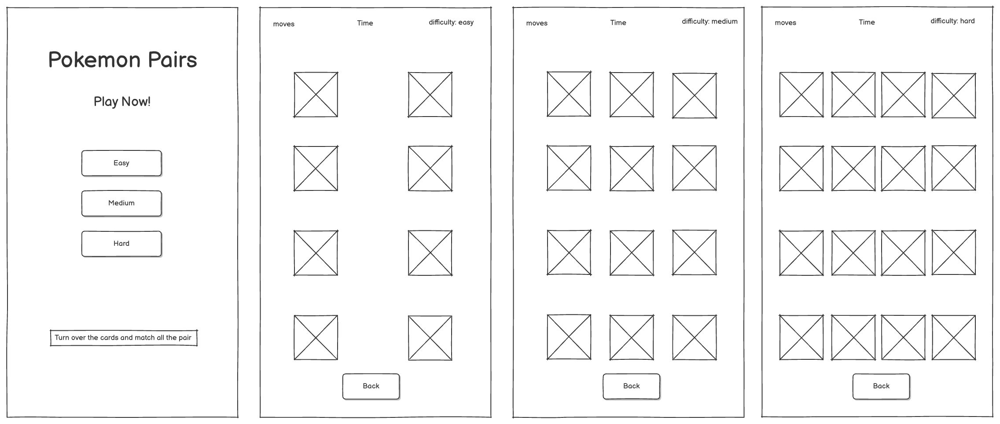
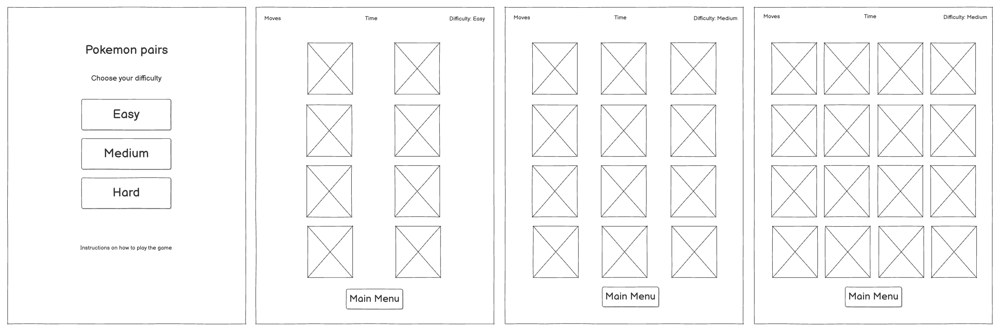
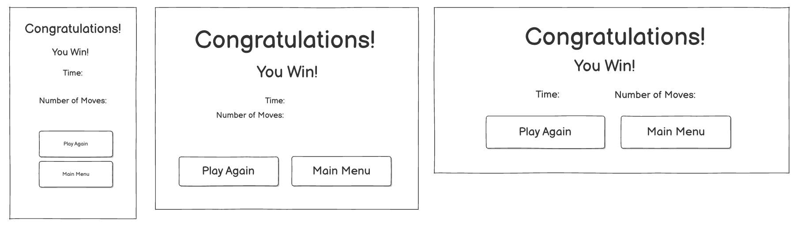

# milestone-project-two

Title

# UX
Project goals: The goal of the project is to build an initeractive front end site. This site will take the form of a pokemon themed pairs game. The game should be fun, ineractive and visually appealing. 

player goals
- to play a fun pairs game
- to play the game on different devices
- to play a simple, easy to understand, but challenging game

developer and business goals
- create an engaging game 
- create a visually appealing game with sound
- create an appeal to pokemon fans with a pokemon theme

user stories
- as a user, i want the game to start quickly to keep my interest
- as a user, i want to be able to increase the difficulty to add more challenge to the game
- as a user, i want to be able to rest the game if i have chosen a difficulty that is too hard
- as a user, i want to be able to see the time/move count in order to see how well i am doing
- as a user, i want a visually appealing game that inspires nostalgia with the pokemon theme
- as a user, i want to able to play the game on different devices so that i can play it anywhere

design choices 
- pictures for the front and the bakc of the crads will be pokemon themed
- colours to be picked from pokemon logos, artworks and other pokemon themed items or ideas.
- font: something clean and clear
- simplistic, minimalist design for the board and scoreboard to keep things easy to understand

wireframes
Mobile:

Tablet:

Desktop:

Victory Modal:

strategy 
scope 
structure
skeleton
surface

# Features
existing features
features to implement

# technologies used

# testing
test user stories
test business goals
code validators
lighthouse
colour testing 
function tests structured: 
    expected:site is expected to do x when user does y
    testing:tested the site by doing y
    result:the site did not do as expected because of a, b, c OR site behaved as expected
    fix:i did z to fix this issue
Bugs

# deployment
how to run this project locally within a coding environment
document steps on how to clone, install and run code 