# Milestone Project Two

# Poke-PAIRS

Poke-PAIRS is a pokemon themed pairs memory game built using HTML, CSS and JavaScript.  
The game is designed to be fun, nostalgic and fully responsive across devices, allowing users to test their memory skills across various difficulties.

[**Live Site**](https://gruheem.github.io/milestone-project-two/)  
[**GitHub Repository**](https://github.com/Gruheem/milestone-project-two)

## Key Features

- Pokemon-themed memory pairs game using Generation One Pokemon
- Multiple difficulty levels with varying grid sizes
- Timer, move counter and error counter to track performance
- Responsive design for mobile, tablet and desktop devices
- Visual Feedback for correct matches
- Victory modal displaying round statistics and replay options

## Home Page
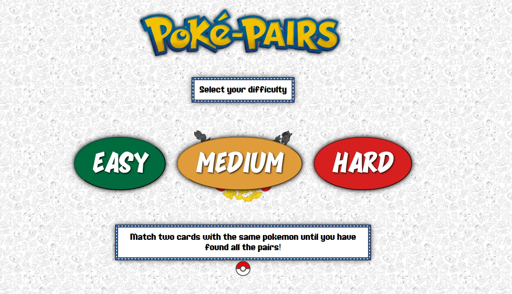

## Game Page
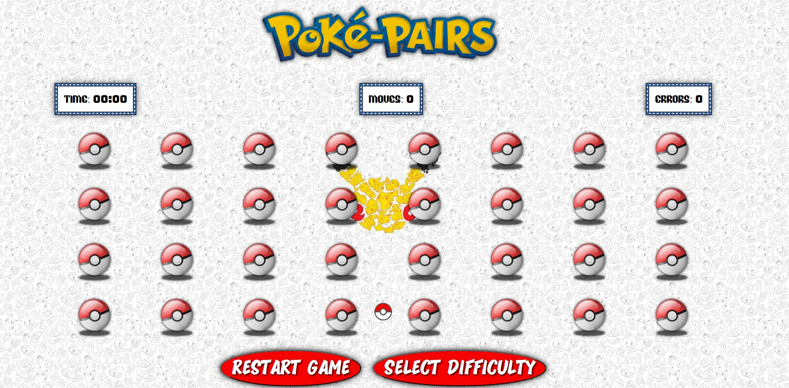

# UX

## Strategy

### Project goals:

- Build and interactive pokemon themed pairs memory game.  
- Provide multiple levels of difficulty to suit player skill levels.
- Ensure the game is responsive and accessible across different devices.
- Demonstrate front-end developemnt skills using HTML, CSS and JavaScript.

### User Personas:

#### The Casual Gamer:  
**Age:** 22  
**Occupation:** University Student  
**Device(s):** Mobile Phone, Laptop  
**Gaming Experience:** Casual  
The casual gamer enjoys quick games between lectures or in the evening to help relax and unwind. They want a simple easy to understand game that loads quickly and is easy and intuitive to navigate.

#### The Nostalgic Pokemon fan:  
**Age:** 33  
**Occupation:** Office Worker  
**Device(s):** Tablet, Laptop  
Gaming Experience: Intermediate  
The nostalgic pokemon fan grew up watching pokemon and playing the original games. They are drawn to nostalgic visuals and sounds, and recognisable pokemon from the original generation.

#### The Competitive gamer:  
**Age:** 26  
**Occupation:** Software Development  
**Devices:** Laptop, Desktop  
**Gaming Experience:** Experienced  
The competitive player enjoys improving their performance and challenging themselves. They want to track their stats, increase the difficulty and enjoys replaying the game to beat their previous score.

#### The On-The-Go Player:  
**Age:** 19  
**Occupation:** College  
**Devices:** Mobile, Tablet  
**Gaming Experience:** Casual  
The on-the-go player plays games while commuting, waiting between classes and in the evenings. They expect the game to work smoothly across different devices and screen sizes.

### Player goals:

- To play a fun and engaging memory pairs game.
- To be able to play the game on different devices.
- To enjoy a simple, easy-to-understand, game with different difficulties.
- to feel rewarded and motivated through feedback and progress tracking.

### Business goals:

1. **Create an interesting, engaging and interactive front-end game experience.**  
Deliver a fun, playable memory game that encourages users to complete and replay rounds. 

2. **Demonstrate front-end development skills**
Showcase effective use of HTML, CSS and JavaScript to build interactive game logic, UI updates, and responsive layouts.

3. **Appeal to pokemon fans through nostalgc themeing**
Use generation one pokemon, recognisable visuals and pokemon inspired colours and styling to create a nostalgic experience.

4. **Create a visually appealing and intuitive used interface**
Ensure the game is easy to understand, visually consistent and intuitive to navigate for first time users.

5. **Ensure responsive design and cross-device compatibility** 
Make the game usable and functionL cross mobile, tablet, and desktop aswell as across a range of modern browsers.

6. **Delivery good performance and fast load times**
Optimise Assets and code to ensure quick loading and smooth gameplay.

## Scope

### User Stories

**User Story 1 - Core Gameplay**  
As a player, I want to play a pairs memory game so that I can enjoy a fun and engaging challange.

Acceptance criteria:

- Have a game board populated with cards.
- The user can flip two cards at a time; matching cards will stay flipped over while non-matching pairs will flip back after a short delay.
- When the round is finished, display a victory message.
- Readily available reset game button to play again.

Tasks:

- Create game board using HTML and CSS and populate with Pokemon cards using JavaScript.
- Create card flipping and matching logic using JavaScript.
- Create victory modal.
- Quick and simple game reset in victory modal.

**User Story 2 - Fast Game Start**  
As a player, I want the game to load quickly so I can start the game without loosing interest. 
Acceptance criteria:

- Ensure game loads quickly.
- Ensure game loads correctly.
- Have an appealing call to action to start the game easily and quickly.

Tasks:

- Use Lighthouse testing for page load.
- Optimise image file sizes and formats.
- Test page load on different devices.
- Create start game button on the home screen.

**User story 3 - Difficulty Selection**  
As a player I want to chnage the game difficulty so that I can adjust the challange to match my skill.
Acceptance criteria:

- Have different difficulties available to the user.
- Have these difficulties readily available and easily accessible at any point during the game.
- Be able to reset the game if I have chosen a difficulty that is too hard.

Tasks:

- Create difficulty buttons on the starting page.
- Create difficulty select button on game page.
- Create difficulty select button on victory modal.

**User story 4 - Performance Tracking**  
As a player, I want to see my time, moves and errors so i can track my performance during the game.

- Have a functioning move counter always visible during the game and on all difficulties.
- Have a functioning timer counting how long the player has spent on that particular round.
- Have an error counter which shows the player's error count during the game.

Tasks:

- Create move tracker.
- Have move tracker update after every turn.
- Create a timer that starts when the game starts and finishes when the game is complete.
- Create error counter.
- Have error counter update after every turn.

**User story 5 - Player Feedback**  
As aplayer, I want visual feedback for correct matches so that I feel motivated to complete the game.

- Have visual feedback for a correct guess (pop and jiggle animation?).

Tasks:

- Create API to gather sounds to play on a correct guess, or
- Have local sound play on correct guess.
- Have animation play on correct guess.

**User story 6 - Visual Theme**  
As a player, I want pokemon themed visual design so that the game feels nostalgic and engaging.

- Have original Pokemon artwork.
- Select Pokemon from the original 151 (Generation One).
- Have colours and themes which are in keeping with the Pokemon branding.

Tasks:

- Create an API to get Pokemon data.
- Select Pokemon numbers 1-151.
- Ensure colours, images and font styles used are taken from Pokemon branding.

**User story 7 - Cross Device Compatibility**  
As a player, I want the game to work on different devices so I can play where ever I am.

- Ensure the game is responsive.
- Ensure the game works on different browsers.
- Ensure the game works on different devices.
- Ensure the game works on different operating systems.

Tasks:

- Make the game responsive using media queries across a range of different screen sizes.
- Test responsiveness with Chrome DevTools.
- Test game on different devices.
- Test game on different operating systems.
- Test game on different browsers.

**User story 8 - Completion Feedback**  
As a player, I want to recieve a completion message and game summary so that I feel rewarded for finishing the game.

- Have a victory modal appear on completion with a nice message.
- Have a round summary in the victory modal.
- Easily restart the game from the modal.
- Easily change the difficulty from the modal.

Tests:

- Create victory modal.
- Make it contain a victory message.
- Make it contain a summary of the stat trackers.
- Make restart game and difficulty select buttons.

## Structure

### Implemented Features:

**'Home Page':**

- Title: The title is in a pokemon theme, stating the name of the game.  
  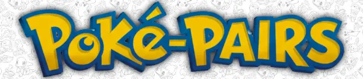

- Instructions: These tell the player exactly how to play the game in one simple short sentence.  
  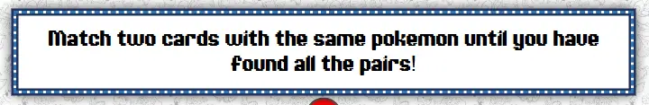

- Call to action: This invites the player to start the game instructing them what they must do.  
  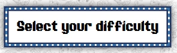

- Difficulty Select section: This allows the player to choose their desired level of challenge.  
  

**'Game Page':**

- Game Timer: This lets the player know how long their current game has lasted so far. It updates in real-time.  
  

- Move Counter: This lets the player how many moves they have spent on the game so far. It updates in real-time.  
  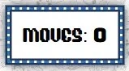

- Error Counter: This lets the player know how many errors they have made in their current game.  
  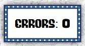

- Pokemon cards: These are the cards the player will select to progress the game. The back is a pokeball and the front is a randomly selected pokemon from generation 1.  
  Back: 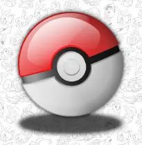  
  Front: 

- Reset Game Button: This allows the player to reset the game at any time during their existing game.
  

- Difficulty Select In-Game: This allows the player to increase or decrease their difficulty at any time incase they get stuck or want more of a challange.
  

- Victory Modal: This congratulates the player on completing the game and presents information and new call to action buttons.  
  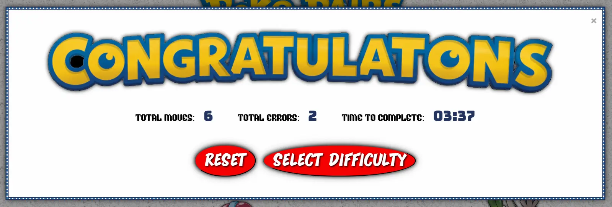

- Stat Summary in Victory Modal: This lets the player know how well they have done in the round they have just played by presenting their game statistics, their game time, move count and error count.  
  

- Reset from Modal: this allows the player to play again on their current level of difficulty with a new set of cards.  
  

- Difficulty select from modal: this allows the player to change their difficulty after completing the game allowing them to increase or decrease the challange.  
  

- Show Cards at Start: Players get a one second look at the cards face up before they flip and the game timer starts. This adds an element of skill to game that allows players to get better without relying on chance to get them started.

- Correct Guess Animation: This animation provides visual feedback on a correct guess to reward and stimulate the player into making more guesses.

- Author information: This Provides information on who wrote the game and a link to their Github page.

## Skeleton

Wireframes
Mobile:
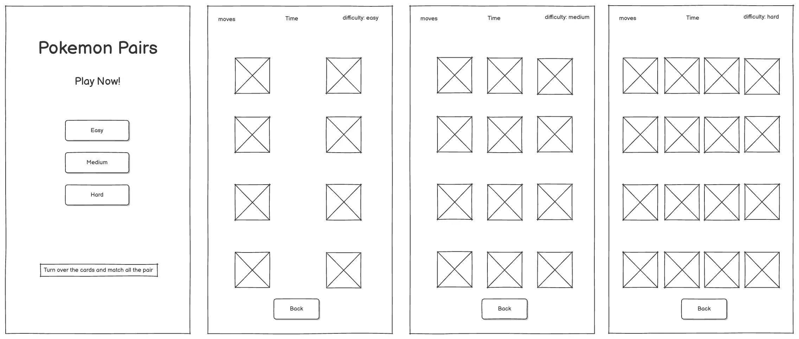

Tablet:
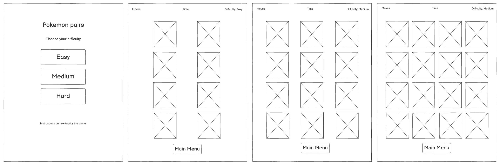

Desktop:
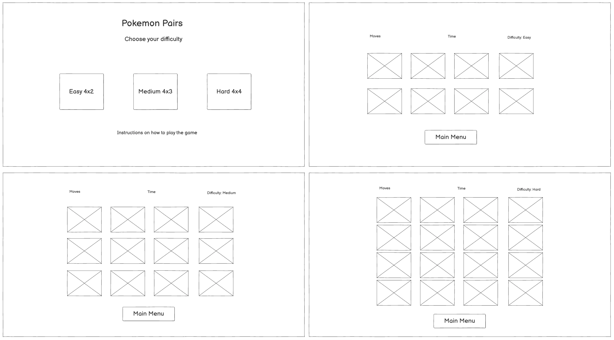

Victory Modal:

# Surface

## Design choices

- Pictures for the front and the back of the cards will be Pokemon-themed.  
  pictures for the pokemon were sourced through the pokemon API called PokeAPI.

- Colours to be picked from Pokemon logos, artworks and other Pokemon-themed items or ideas.  
  Colours were captured using image color picker on the main title. All colours have been tested for contrast and suitability.

- Fonts:
  1. Primary: the 'Pokemon' title font. Created images inspired directly form the pokemon main logo.
  2. Secondary: A clear and game themed font to descibe, 'gamepause' sans-serif.
  3. Tertiary: A clear font reminiscant of the pokemon banding for the calls to action.

- Simplistic, minimalist design for the board and scoreboard to make navigation easy and intuitive. this also keeps the game easy to understand.

# Technologies Used

## Languages

HTML  
CSS  
JavaScript  

## Libraries

Google Fonts  
Game Fonts  
Favicon

## Technologies

PokeAPI  
Google Gemini Image Creator  
Adobe Express
https://imagecolorpicker.com/

## Practices

Mobile first developement

## Resources

https://www.justinmind.com/blog/best-number-fonts/

# Testing

Test user stories  

## User Story Testing  

### User Story 1 - Core Gameplay 
**Test 1.1 - Game board loads with cards** 
  - **Scenario:** Player selects a difficulty and starts the game
  - **Expected:** 
    - A board of cards loads 
    - All the cards are face down
  - **testing:** Started the game from the home page using a difficulty selction button
  - **Result:** The board populates with the correct number of cards for the difficulty and they are all face down
  - **Test Status:** Passed

**Test 1.2 - Matched Cards stay flipped**
  - **Scenario:** The player picks two of the same cards and makes a correct guess
  - **Expected:** On a correct guess the cards will stay flipped over 
  - **Testing:** Selected two mtching cards during the game
  - **Result:** Cards stay flipped over and animation plays
  - **Test Status:** Passed

 **test 1.3 - Incorrect card match flip back**
  - **Scenario:** The player picks two cards but they are different images
  - **Expected:** Cards remain visib le for one second then reset to their 'back' state
  - **Testing:** Selecting two different cards that don't match
  - **Result:** The cards flip back after a short delay
  - **Test Status:** Passed

**test 1.4 - Victory Modal Presence**
  - **Scenario:** The player completes the game by matching all the pairs
  - **Expected:** When the player completes the game a victory modal will appear
  - **Testing:** Completed the game by matching all crads
  - **Result:** The victory modal appears when all cards are matched
  - **Test Status:** Passed

### User story 2 - Fast Game Start

  **test 2.1 - Page Load Performance**
  - **Scenario:** The player opens the games home page
  - **Expected:** The page loads correctly without any missing elements or layout issues
  - **Testing:** Performed Lighthouse Testing and manual refresh testing
  - **Result:** The page loads in a timely manner and correctly displays its contents
  - **Test Status:** Passed

  **test - Start Game Call-to-action**
  - **Scenario:** The player clicks on the difficulty select buttons to start the game
  - **Expected:** The game begins immediately
  - **Testing:** Pressed the start game buttons
  - **Result:** Game starts as expected
  - **Test Status:** Passed

### User Story 3 - Difficulty Seleciton

  **test 3.1 - Difficulty Selection Changes Layout**
  - **Scenario:** Selecting different difficulties populates the board with different amount of cards
  - **Expected:** The game board changes the amount of different cards depending on the difficulty
  - **Testing:** started the game on each different difficulty
  - **Result:** Grid size adjusted correctly for different difficulties
  - **Test Status:** Passed

  **test 3.2 - Difficulty can be changed during gameplay**
  - **Scenario:** The player changes difficulty mid-way through a game
  - **Expected:** The current game resets with the new difficulty settings
  - **Testing:** Checged difficulty in game
  - **Result:** The game reset and loaded the new difficulty
  - **Test Status:** Passed

  ### User story 4 - Performance Tracking

  **test 4.1 - Move counter increments correctly**
  - **Scenario:** The player completes a turn by selecting two cards
  - **Expected:** The move counter increases by one
  - **Testing:** Completed a move by selecting two cards
  - **Result:** The card counter updated correctly by increasing by one
  - **Test Status:** Passed

  **test 4.2 - Timer Starts and Stops correctly**
  - **Scenario:** A play starts and completes the game
  - **Expected:** The timer starts on game start and stops when the game is completed
  - **Testing:** Observed the timer during and after the game
  - **Result:** The timer starts, keeps time, and stops correctly
  - **Test Status:** Passed

  **test 4.3 - Error Counter Increments Correctly**
  - **Scenario:** A player selects two non matching cards
  - **Expected:** The error counter increases by one
  - **Testing:** Made an incorrect guess in game
  - **Result:** Error counter updated cortrectly by increasing by one
  - **Test Status:** Passed

### User Story 7 - Cross-device Compatibility

  **test 7.1 - Responsive Layout Across Different Devices**
  - **Scenario:** A player accesses the game on mobile, tablet and desktop
  - **Expected:** The layout adapts correctly to different screen sizes and remains functional
  - **Testing:** used Chrome Dev Tools device emulator and multiple physical devices
  - **Result:** Layout displayed correctly on all tested screen sizes
  - **Test Status:** Passed

**test 7.2 - Browser Compatibility**
  - **Scenario:** A player accesses the game on different modern web browsers
  - **Expected:** The game functions correctly across different browsers
  - **Tesitng:** Opened the game on Chrome, Firefox, Edge and Safari
  - **Result:** No functional issues arose
  - **Test Status:** Passed

### User Story 8 - Completion Feedback

  **test 8.1 - Victory modal displays content correctly**
  - **Scenario:** A player completes the game by matching all the piars
  - **Expected:** A vitory modal appears with a congratulations message with game statistics
  - **Testing:** Completed a game
  - **Result:** Modal displays with correctly with the corrrect stats within it
  - **Test Status:** Passed

  **test 8.2 - Post game Actions Function Correctly**
  - **Scenario:** The player interacts with the Restart Game and Select Difficulty buttons in the modal
  - **Expected:** The game restarts and loads the selected difficulty
  - **Testing:** Interact with the buttons in the modal
  - **Result:** Buttons funtioned correctly
  - **Test Status:** Passed

## Business Goal Testing

### Business Goals 1 - Create an interesting, engaging and interactive front-end game experience.
**Goal:** Deliver a fun, playable memory game that encourages users to complete and replay rounds.  
**scenario:** A user play the game from start to finish and is encourageed to replay using visual feedbck, difficulty options and completion messaging.  
**expected:** 
  - Core gameplay functions smoothly
  - Visual and audio feedback rewards corrcet actions
  - layers are encouraged to replay the game  

**Testing:** Played multiple full rounds across different difficulties and observed player flow and engagement  
**Result:** Gameplay was smooth, visual and audio feedbakc was clear and replay options were easily accessible  
**Test Status:** PASS

### Business Goals 2 - Demonstrate front-end development skills
**Goal:** Showcase effective use of HTML, CSS and JavaScript to build interactive game logic, UI updates, and responsive layouts.  
**scenario:** A hypothetical assesor is reviewing and marking the site's structure, styling and interactive features.
**expected:**
  - Clean semantic HTML structure
  - Responsive layouts using CSS
  - Game logic handled efficiently using JavaScript  

**Testing:** Reviewed codebase and validated HTML and CSS using online validators.
**Result:** Code demonstrates effective use of tachnologies.
**Test Status:** PASS

### Business Goals 3 - Appeal to pokemon fans through nostalgc themeing
**Goal:**Use generation one pokemon, recognisable visuals and pokemon inspired colours and styling to create a nostalgic experience.  
**scenario:** A pokemon fan visits the site and recognises Generation one pokemon and familiar visual styles.
**expected:**
  - Use of Generation one pokemon 
  - Pokemon inspired colours, fonts and imagery
  - Consistent theme throughout the site  

**Testing:** Reviewed game visuals and pokemon selecrin during gameplay.  
**Result:** Theme remainedd consistent and recognisable throughout the game.
**Test Status:** PASS

### Business Goals 4 - Create a visually appealing and intuitive used interface
**Goal:** Ensure the game is easy to understand, visually consistent and intuitive to navigate for first time users.  
**scenario:** A user first time user visits the site and attem,pts to start and play the game usinf only the on screen interface.  
**expected:** 
  - Clear instructions explaining how to play
  - Clearly visible and intuitive controls/buttons
  - Consistent visual design across all pages and models  

**Testing:** Navigated through the home page and gameplay using only the provided interface elements.
**Result:** The user was able to understand the game and navigate the interface without confusion, visual design remained consistent throughout.  
**Test Status:** PASS

### Business Goals 5 - Ensure responsive design and cross-device compatibility
**Goal:** Make the game usable and functionL cross mobile, tablet, and desktop aswell as across a range of modern browsers.  
**scenario:** A user accesses the game on different devices and broswers.  
**expected:**
  - Responsive layout
  - No functional loss across screren sizes
  - consistent behaviour across browsers  

**Testing:** Tested responsiveness on Google Chrome DevTools and different physical devices.  
**Result:** Game remained fully functional across tested devices and browsers.
**Test Status:** PASS

### Business Goals 6 - Delivery good performance and fast load times
**Goal:** Optimise Assets and code to ensure quick loading and smooth gameplay.  
**scenario:** A user opens the site and starts a game without delay.  
**expected:**
  - Fast page load times
  - Optimised assets
  - Smooth gameplay performance  

**Testing:** Ran lighthouse performance tests and manually observed loading behaviour.
**Result:** Performance scores were in an acceptable range and gameplay was smooth.
**Test Status:** PASS

 
## Code Validation Testing

HTML code validation testing was performed using the [W3C Markup Validation Service](https://validator.w3.org/). It picked up one semantic error where I had gone from `h1` to `h3` without using a `h2` element.  

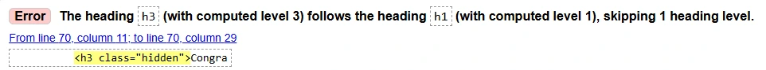  

This was corrected and the HTML now passes code validation.  

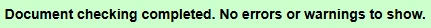
  
CSS code validation testing was performed using the [W3C CSS Validaiton Service](https://jigsaw.w3.org/css-validator/). It did not pick up any errors and the CSS passes code validation.  

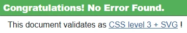

## Lighthouse Testing  

Lighthouse testiung was performed on Google Chrome DevTools and for each catagory has been given a score in the acceptable range.  

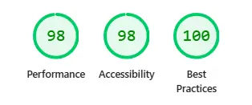  

Performance Overview:  

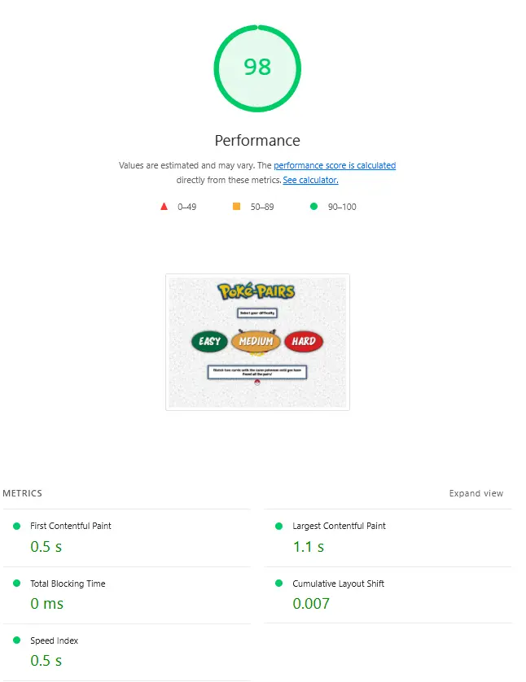  

Accessibility Overview:  

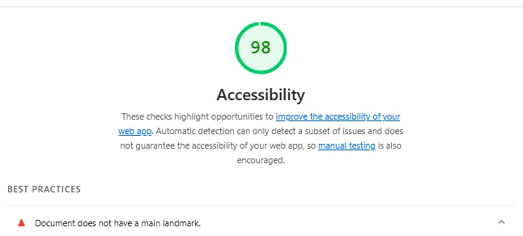  

Best Practises Overview:  

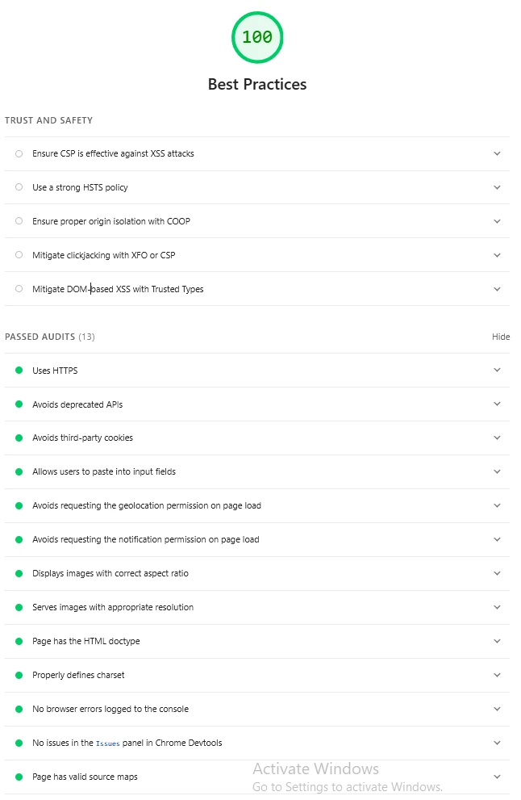

## Colour Testing 

Function tests structured:  
 Expected: site is expected to do x when user does y  
 Testing: tested the site by doing y  
 Result: the site did not do as expected because of a, b, c OR site behaved as expected  
 Fix: I did z to fix this issue

# Known Bugs and Fixes:

**1. Card Overflow Issue:**  
Cards were overflowing out of the game board. It was due to the CSS Grid automatically applying `min-height: auto;` to the grid.   
**- Fix:**  
I fixed this by setting `min-height` to `0` on the card wrapper to allow it to shrink.

**2. Variable Scope Declaration and Timing Issue:**  
The game start buttons stopped working. I had placed an event listener that used a variable in a function before I had declared the variable globaly. This was a timing issue as javascript runs top to bottom.  
**- Fix:**  
I delared the variable `let difficulty;`at the start of the javascript file before any functions are read.

**3. Modal Visibility Issue:**  
Modal wasnt appearing after reseting game using the victory modal. The source of the problem was that I was mixing two different ways of hiding it when not in use `modal.classList.add("hidden");` and `modal.display = "none";`  
**- Fix:**  
I fixed this issue by sticking to one method of achieve adding and removing the `.hidden` class to acheive the desired visability state.  

**4. Error Counter Logic Issue:**
The error counter was creating a list of ones rather than adding a up a total. The problem was that I wasnt declaring the variable errors on a global scale, it was just in the start game function so it couldnt be accessed by the update function.  
**- Fix:**  
Declared the errors variable `let errors = 0` at the start of the document before any functions are read.

**5. Duplicate Pokemon Selection Issue:**  
As I am using random numbers to select the Pokemon it is possible for the same Pokemon to be picked more than once, e.g., Bulbasaur is picked 4 times and is every Pokemon in an eight-card grid.  
**- Fix:**  
I created and array of `usedIds` and a `do while` statement to continue to pick IDs until the proposed ID does not exist in the `usedIds` array.

# Deployment

This project was deployed using GitHub Pages.  

I took the approach of using **early deployment** so I can start observing the desired and undesired outcomes of my code across different devices as soon as possible.
  
## Steps to Deploy
1. Navigate to the repository on GitHub
2. Open **settings** got to **pages**  
3. Select the 'main' branch and root directory
4. Save changes
5. The live site link appears after deployment ([Deployed Site](https://gruheem.github.io/milestone-project-two/)) 

## How to run Locally
1. Clone the repository, replacing 'your-username' with your GitHub username and 'your-repo-name' with the name of your repository.  
Bash: `git clone https://github.com/your-username/your-repo-name.git`  
2. Navigate to the directory, obnce again replacing 'your-repo-name' with the name of your repository.  
Bash: `cd your-repo-name`  
3. Launch the project.
    - Open the project folder in your preffered IDE (e.g. VS Code)
    - Open `index.html` directly in your browser, or use an extension like **Live Server** to open the page

