# Milestone Project - Two Poke-PAIRS

# Poke-PAIRS

Poke-PAIRS is a Pokémon-themed pairs memory game built using HTML, CSS, and JavaScript.  
The game is designed to be fun, nostalgic, and fully responsive across devices, allowing users to test their memory skills at various difficulty levels.

[**Live Site**](https://gruheem.github.io/milestone-project-two/)  
[**GitHub Repository**](https://github.com/Gruheem/milestone-project-two)

## Key Features

- Pokémon-themed memory pairs game using Generation One Pokémon
- Multiple difficulty levels with varying grid sizes
- Timer, move counter, and error counter to track performance
- Responsive design for mobile, tablet, and desktop devices
- Visual feedback for correct matches
- Victory modal displaying round statistics and replay options

## Home Page

## Game Page

  

# Contents:
- [UX](#ux)
  - [Strategy](#strategy)
    - [Project Goals](#project-goals)
    - [Business Goals](#business-goals)
    - [Player Goals](#player-goals)
  - [Scope](#scope)
    - [User Personas](#user-personas)
  - [Structure](#structure)
    - [Implemented Features](#implemented-features)
  - [Skeleton](#skeleton)
  - [Surface](#surface)
    - [Design Choices](#design-choices)
      - [Artwork](#artwork)
      - [Colour Theme](#colour-testing)
      - [Fonts](#fonts)
      - [Audio](#audio)
- [Accessibility](#accessibility)
- [Technologies Used](#technologies-used)
  - [Languages](#languages)
  - [Libraries](#libraries)
  - [Tools](#tools)
  - [Practices](#practices)
  - [Resources](#resources)
- [Deployment](#deployment)
 - [Steps to Deploy](#steps-to-deploy)
 - [How to Run Locally](#how-to-run-locally)
- [Known Bugs and Fixes](#known-bugs-and-fixes)
- [Code Attribution](#code-attribution)
- [Testing](#testing)
  - [User Story Testing](#user-story-testing)
  - [Business Goal Testing](#business-goal-testing)
  - [Code Validation Testing](#code-validation-testing)
  - [Lighthouse Testing](#lighthouse-testing)
  - [Colour Testing](#colour-testing)
  - [Function Testing](#function-testing)

# UX

## Strategy

### Project goals:

- Design and develop an interactive Pokémon-themed pairs memory game.
- Implement multiple levels of difficulty to suit different players' skill levels.
- Ensure the game is responsive and accessible across a variety of different devices.
- Demonstrate front-end development skills through the effective use of HTML, CSS, and JavaScript.

### Business goals:

1. **Create an interesting, engaging and interactive front-end game experience.**  
   Deliver a fun, playable memory game that encourages users to complete and replay rounds.

2. **Demonstrate front-end development skills**
   Showcase effective use of HTML, CSS and JavaScript to build interactive game logic, UI updates, and responsive layouts.

3. **Appeal to Pokémon fans through nostalgic theming.**
   Use Generation One Pokémon, recognisable visuals, and Pokémon-inspired colours and styling to create a nostalgic experience.

4. **Create a visually appealing and intuitive user interface.**
   Ensure the game is easy to understand, visually consistent, and intuitive to navigate for first-time users.

5. **Ensure responsive design and cross-device compatibility**
   Make the game usable and functional across mobile, tablet, and desktop devices, as well as across a range of modern browsers.

6. **Deliver good performance and fast load times.**
   Optimise assets and code to ensure quick loading and smooth gameplay.

### User Personas:

#### The Casual Gamer:

**Age:** 22  
**Occupation:** University Student  
**Device(s):** Mobile Phone, Laptop  
**Gaming Experience:** Casual  
The casual gamer enjoys quick games between lectures or in the evening to help relax and unwind. They want a simple, easy-to-understand game that loads quickly and is easy and intuitive to navigate.

#### The Nostalgic Pokémon Fan:

**Age:** 33  
**Occupation:** Office Worker  
**Device(s):** Tablet, Laptop  
**Gaming Experience:** Intermediate  
The nostalgic Pokémon fan grew up watching Pokémon and playing the original games. They are drawn to nostalgic visuals and sounds and recognisable Pokémon from the original generation.

#### The Competitive Gamer:

**Age:** 26  
**Occupation:** Software Development  
**Devices:** Laptop, Desktop  
**Gaming Experience:** Experienced  
The competitive player enjoys improving their performance and challenging themselves. They want to track their stats, increase the difficulty, and enjoy replaying the game to beat their previous score.

#### The On-The-Go Player:

**Age:** 19  
**Occupation:** College  
**Devices:** Mobile, Tablet  
**Gaming Experience:** Casual  
The on-the-go player plays games while commuting, waiting between classes and in the evenings. They expect the game to work smoothly across different devices and screen sizes.

### Player goals:

- To play a fun and engaging memory pairs game.
- To be able to play the game on different devices.
- To enjoy a simple, easy-to-understand game with different difficulties.
- To feel rewarded and motivated through feedback and progress tracking.

## Scope

### User Stories

**User Story 1 - Core Gameplay**  
As a player, I want to play a pairs memory game so that I can enjoy a fun and engaging challenge.

Acceptance criteria:

- Have a game board populated with cards.
- The user can flip two cards at a time; matching cards will stay flipped over while non-matching pairs will flip back after a short delay.
- When the round is finished, display a victory message.
- A readily available reset game button to play again.

Tasks:

- Create a game board using HTML and CSS and populate it with Pokémon cards using JavaScript.
- Create card-flipping and matching logic using JavaScript.
- Create a victory modal.
- Provide a quick and simple game reset option in the victory modal.

**User Story 2 - Fast Game Start**
As a player, I want the game to load quickly so I can start the game without losing interest.  

Acceptance criteria:

- Ensure the game loads quickly.
- Ensure the game loads correctly.
- Have an appealing call-to-action to start the game quickly and easily.

Tasks:

- Use Lighthouse to test page load performance.
- Optimise image file sizes and formats.
- Test page load on different devices.
- Create start game button on the home screen.

**User story 3 - Difficulty Selection**  
As a player, I want to change the game difficulty so that I can adjust the challenge to match my skill.  

Acceptance criteria:

- Have different difficulties available to the user.
- Have these difficulties readily available and easily accessible at any point during the game.
- Be able to reset the game if I have chosen a difficulty that is too hard.

Tasks:

- Create difficulty buttons on the starting page.
- Create difficulty select button on game page.
- Create difficulty select button on victory modal.

**User story 4 - Performance Tracking**  
As a player, I want to see my time, moves, and errors so I can track my performance during the game.  

Acceptance criteria:

- Have a functioning move counter always visible during the game and on all difficulties.
- Have a functioning timer counting how long the player has spent on that particular round.
- Have an error counter which shows the player's error count during the game.

Tasks:

- Create move tracker.
- Have move tracker update after every turn.
- Create a timer that starts when the game starts and finishes when the game is complete.
- Create error counter.
- Have error counter update after every turn.

**User story 5 - Player Feedback**  
As a player, I want visual feedback for correct matches so that I feel motivated to complete the game.  

Acceptance criteria:

- Have visual feedback for a correct guess (e.g., pop and jiggle animation).
- Have audio feedback for correct and incorrect guesses

Tasks:

- Create an API to gather sounds to play on a correct guess, or
- Play a local sound on a correct guess.
- Play an animation on a correct guess.

**User story 6 - Visual Theme**  
As a player, I want Pokémon-themed visual design so that the game feels nostalgic and engaging.  

Acceptance criteria:

- Use original Pokémon artwork.
- Select Pokémon from the original 151 (Generation One).
- Use colours and themes that are in keeping with Pokémon branding.

Tasks:

- Create an API to get Pokémon data.
- Select Pokémon numbered 1–151.
- Ensure colours, images, and font styles used are taken from Pokémon branding.

**User story 7 - Cross Device Compatibility**  
As a player, I want the game to work on different devices so I can play wherever I am.  

Acceptance criteria:

- Ensure the game is responsive.
- Ensure the game works on different browsers.
- Ensure the game works on different devices.
- Ensure the game works on different operating systems.

Tasks:

- Make the game responsive using media queries across a range of different screen sizes.
- Test responsiveness with Chrome DevTools.
- Test game on different devices.
- Test game on different operating systems.
- Test game on different browsers.

**User story 8 - Completion Feedback**  
As a player, I want to receive a completion message and game summary so that I feel rewarded for finishing the game.  

Acceptance criteria:

- Have a victory modal appear on completion with a nice message.
- Have a round summary in the victory modal.
- Easily restart the game from the modal.
- Easily change the difficulty from the modal.

Tests:

- Create victory modal.
- Make it contain a victory message.
- Make it contain a summary of the stat trackers.
- Make restart game and difficulty select buttons.

## Structure

### Implemented Features:

**Persistent Features:**

- **Mute/Unmute Button:** This allows the player to mute and unmute the game sounds. This is fixed at the top right for visibility.  
  

- **Author Information:** A link to the author's GitHub page; fixed at the bottom right.  
  

**Home Page:**

- **Title:** The title is in a Pokémon theme, stating the name of the game.  
  

- **Instructions:** These tell the player exactly how to play the game in one simple, short sentence.  
  

- **Call-to-action:** This invites the player to start the game and instructs them what they must do.  
  

- **Difficulty Select section:** This allows the player to choose their desired level of challenge.  
  

**Game Page:**

- **Game Timer:** This lets the player know how long their current game has lasted so far. It updates in real time.  
  

- **Move Counter:** This lets the player know how many moves they have made so far. It updates in real time.  
  

- **Error Counter:** This lets the player know how many errors they have made in their current game.  
  

- **Pokémon cards:** These are the cards the player will select to progress the game. The back is a Poké Ball and the front is a randomly selected Pokémon from Generation One.  
  Back:  
    
  Front:  
  

- **Reset Game Button:** This allows the player to reset the game at any time during their existing game.  
  

- **Difficulty Select In-Game:** This allows the player to increase or decrease their difficulty at any time in case they get stuck or want more of a challenge.  
  

- **Victory Modal:** This congratulates the player on completing the game and presents information and new call to action buttons.  
  

- **Stat Summary in Victory Modal:** This lets the player know how well they have done in the round they have just played by presenting their game statistics, their game time, move count and error count.  
  

- **Reset from Modal:** this allows the player to play again on their current level of difficulty with a new set of cards.  
  

- **Difficulty select from modal:** This allows the player to change their difficulty after completing the game, allowing them to increase or decrease the challenge.  
  

- **Show Cards at Start:** Players get a one second look at the cards face up before they flip and the game timer starts. This adds an element of skill to game that allows players to get better without relying on chance to get them started.

- **Correct Guess Animation:** This animation provides visual feedback on a correct guess to reward and stimulate the player into making more guesses.

- **Card Flip Animation:** The Cards have a flip animation when they change which side is facing up. This improves the player experience by creating a smoother game play experience

- **Author information:** This provides information on who wrote the game and a link to their GitHub page.

## Skeleton

Wireframes were created using [balsamiq](https://balsamiq.com/).

Mobile:

Tablet:

Desktop:

Victory Modal:

# Surface

## Design choices

### Artwork

Pictures for the front and back of the cards are Pokémon-themed. Pictures for the Pokémon were sourced through the [PokeAPI](https://pokeapi.co/), this artwork was originally created by [Ken Sugimori](https://en.wikipedia.org/wiki/Ken_Sugimori).

The main title and the modal title were generated using [gemini](https://gemini.google.com/).

The background image came from [The Pokemon Company](https://corporate.pokemon.com/en-us/) celebrating their 20th anniversary.

### Colour theme

Colours were picked from Poke-pairs title and background image to ensure a consistent theme throughout.

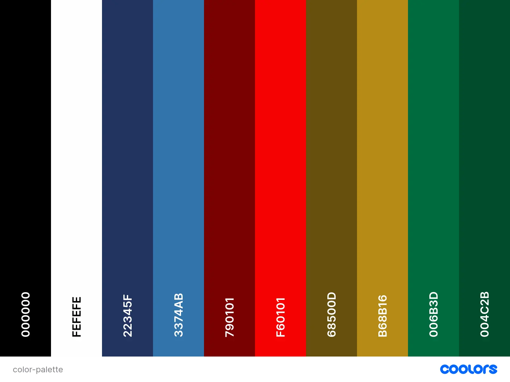

Colours were captured using [image color picker](https://imagecolorpicker.com/).  
All colours have been tested for contrast and suitability.

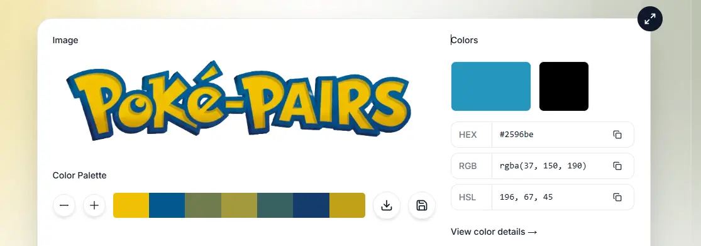  
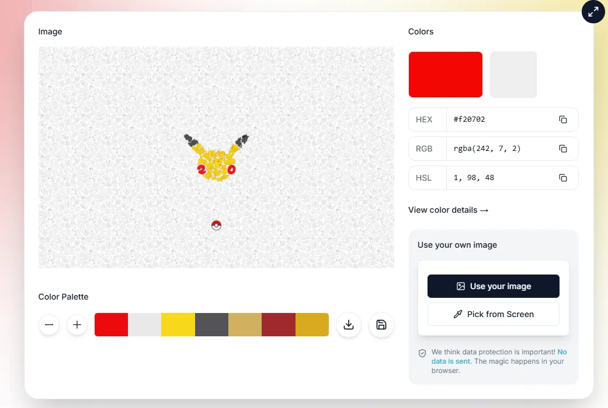

### Fonts

1. Primary: the 'Pokémon' title font — images inspired directly from the Pokémon main logo.
2. Secondary: a clear and game-themed font to inspire nostalgia for the generation one games and to describe instructions and actions, ['gamepause'](https://www.fontspace.com/game-paused-font-f102167) sans-serif.
3. Tertiary: a clear font that has been rated excellent for displaying numbers by [Just In Mind's Blog](https://www.justinmind.com/blog/best-number-fonts/), 'bungee', sans-serif.

Simplistic, minimalist design for the instructions, start buttons and stat trackers to make navigation easy and intuitive. This also keeps the game easy to understand.

### Audio

The audio files were gathered from [Pixabay](https://pixabay.com/sound-effects/). For a good user experience the audio to the game is muted by default. The audio files used have had their volume levels reduced between 60-80% using JavaScript for player comfort.

# Accessibility

This website is designed with accessibility in mind and follows [WCAG (Web Content Accessibility Guidelines)](https://www.w3.org/WAI/standards-guidelines/wcag/) best practices. Semantic HTML is used throughout to ensure content is meaningful and navigable for assistive technologies. [ARIA labels and roles](https://www.w3schools.com/accessibility/accessibility_labels.php) are applied where necessary, and made dynamic on elements that need it change,to provide clear context for screen readers. 

# Technologies Used

## Languages

[HTML](https://www.w3schools.com/html/)  
[CSS](https://www.w3schools.com/css/)  
[JavaScript](https://www.w3schools.com/js/)

## Libraries

[Font Space](https://www.fontspace.com/)  
[Pixabay Sound Effects](https://pixabay.com/sound-effects/)

## Tools

[PokeAPI](https://pokeapi.co/)  
[Adobe Express](https://www.adobe.com/uk/express/)  
[Image Color Picker](https://imagecolorpicker.com/)  
[Web Aim Contrast Checker](https://webaim.org/resources/contrastchecker/)  
[Eight Shapes Contrast Grid](https://contrast-grid.eightshapes.com/)  
[Coolers](https://coolors.co/)  
[Chat GPT](https://chatgpt.com/)  
[claude](https://claude.ai/)  
[Gemini](https://gemini.google.com/)  
[Balsamiq Wireframes](https://balsamiq.com/)
[GitHub Pages](https://docs.github.com/en/pages)

## Practices

[UX](https://en.wikipedia.org/wiki/User_experience_design)  
[Mobile-first development](https://developer.mozilla.org/en-US/docs/Glossary/Mobile_First)
[WCAG](https://www.w3.org/WAI/standards-guidelines/wcag/)

## Resources

[Best Number Font Blog Post](https://www.justinmind.com/blog/best-number-fonts/)  
[Kenny Yip Coding](https://www.youtube.com/@KennyYipCoding)  
[Web Dev Simplified](https://www.youtube.com/@WebDevSimplified)  
[Fisher Yates Shuffle](https://www.geeksforgeeks.org/dsa/shuffle-a-given-array-using-fisher-yates-shuffle-algorithm/)

# Deployment

This project was deployed using [GitHub Pages](https://docs.github.com/en/pages).

I took the approach of using **early deployment** so I can start observing the desired and undesired outcomes of my code across different devices as soon as possible.

## Steps to Deploy

1. Navigate to the repository on GitHub
2. Open **settings** got to **pages**
3. Select the 'main' branch and root directory
4. Save changes
5. The live site link appears after deployment ([Deployed Site](https://gruheem.github.io/milestone-project-two/))

## How to Run Locally

1. Clone the repository, replacing 'your-username' with your GitHub username and 'your-repo-name' with the name of your repository.  
   Bash: `git clone https://github.com/your-username/your-repo-name.git`
2. Navigate to the directory, once again replacing 'your-repo-name' with the name of your repository.  
   Bash: `cd your-repo-name`
3. Launch the project.
   - Open the project folder in your preferred IDE (e.g. VS Code)
   - Open `index.html` directly in your browser, or use an extension like **Live Server** to open the page

# Known Bugs and Fixes:

**1. Card Overflow Issue:**  
Cards were overflowing out of the game board. It was due to the CSS Grid automatically applying `min-height: auto;` to the grid.  
**- Fix:**  
I fixed this by setting `min-height` to `0` on the card wrapper to allow it to shrink.

**2. Variable Scope Declaration and Timing Issue:**  
The game start buttons stopped working. I had placed an event listener that used a variable in a function before I had declared the variable globally. This was a timing issue as JavaScript runs top to bottom.  
**- Fix:**  
I declared the variable `let difficulty;` at the start of the JavaScript file before any functions are executed.

**3. Modal Visibility Issue:**  
Modal wasn't appearing after resetting the game using the victory modal. The source of the problem was that I was mixing two different ways of hiding it when not in use: `modal.classList.add("hidden");` and `modal.display = "none";`  
**- Fix:**  
I fixed this issue by sticking to one method of adding and removing the `.hidden` class to achieve the desired visibility state.

**4. Error Counter Logic Issue:**
The error counter was creating a list of ones rather than adding up a total. The problem was that I wasn't declaring the `errors` variable globally; it was only in the start game function so it couldn't be accessed by the update function.  
**- Fix:**  
Declared the `errors` variable `let errors = 0` at the start of the document before any functions are read.

**5. Duplicate Pokémon Selection Issue:**  
As I used random numbers to select Pokémon, the same Pokémon could be picked multiple times (e.g., Bulbasaur appearing four times in an eight-card grid).  
**- Fix:**  
I created an array of `usedIds` and a `do...while` statement to continue picking IDs until the proposed ID does not exist in the `usedIds` array.

# Code Attribution

All HTML, CSS, and JavaScript code for game logic, UI interactions, and styling was written by me specifically for this project.

The [Fisher-Yates-Shuffle](https://en.wikipedia.org/wiki/Fisher%E2%80%93Yates_shuffle) was adapted from a [geeksforgeeks](https://www.geeksforgeeks.org/dsa/shuffle-a-given-array-using-fisher-yates-shuffle-algorithm/) article.

The code for the timer functions was adapted from code [Chat GPT](https://chatgpt.com/) wrote.

The idea to iterate through the rows and columns to populate the game board and javascript array, along with how I could structure the matching logic, was inspired by [Kenny Yip Coding](https://www.youtube.com/@KennyYipCoding)'s YouTube video tutorial on [making a pairs game](https://www.youtube.com/watch?v=wz9jeI9M9hI&list=LL&index=2).

# Testing

This project has been thoroughly tested across a number of metrics and standards; the tests, evidence, and findings are below.

The decision was made to focus on manual testing rather than create automated tests. This decision was made based on the nature of the project, as the focus was on:

- **Usability testing** - Evaluating user experience and interface intuitiveness
- **Visual testing** - Checking Layout, responsiveness and visual (and audio) feedback
- **Exploratory testing** - Finding unexpected bugs through real world usage
- **Learning outcomes** - Manual testing allowed me to thoroughly understand how each component works and interacts with the user interface.

Automated testing would be deployed if there were a need for regression testing (for example, when the game's logic changes regularly), large-scale or repetitive tasks requiring frequent checks, or when multiple developers are working on the project. Automated testing supports managing deployment pipelines and continuous integration.

## User Story Testing

The following user story and business goal tests are used as the basis for testing the Project and Player Goals of the Pokémon pairs memory game. Each story defines a specific user requirement and is supported by test scenarios to verify that the game behaves as expected. This approach ensures that core features and responsive behaviour can be systematically tested and validated against user needs.

### User Story 1 - Core Gameplay

**Test 1.1 - Game board loads with cards**

- **Scenario:** Player selects a difficulty and starts the game
- **Expected:**
  - A board of cards loads
  - All the cards are face down
- **Testing:** Started the game from the home page using a difficulty selection button
- **Result:** The board populates with the correct number of cards for the difficulty and they are all face down
- **Test Status:** PASS

Easy:  
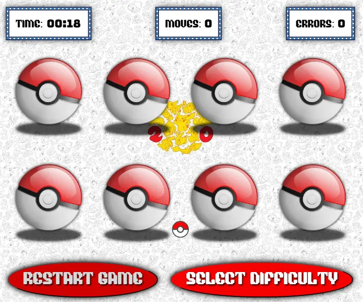  
Medium  
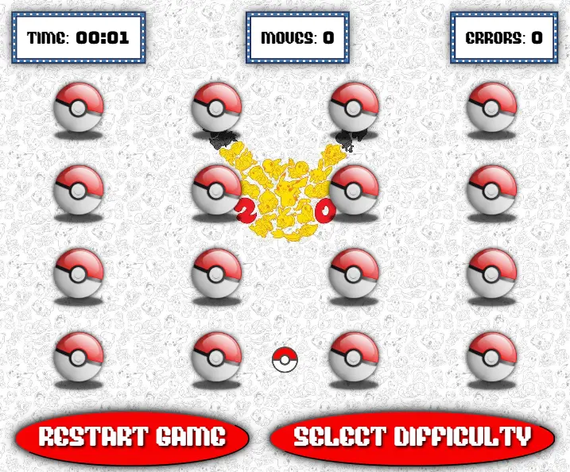  
Hard:  
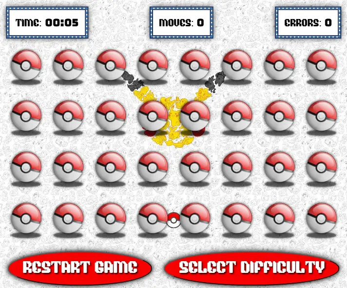

**Test 1.2 - Matched Cards stay flipped**

- **Scenario:** The player picks two of the same cards and makes a correct guess
- **Expected:** On a correct guess the cards will stay flipped over
- **Testing:** Selected two matching cards during the game
- **Result:** Cards stay flipped over and animation plays
- **Test Status:** PASS

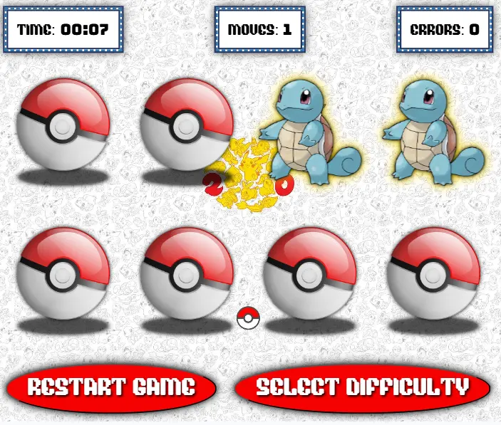

**Test 1.3 - Incorrect card match flip back**

- **Scenario:** The player picks two cards but they are different images
- **Expected:** Cards remain visible for one second then reset to their 'back' state
- **Testing:** Selecting two different cards that don't match
- **Result:** The cards flip back after a short delay
- **Test Status:** PASS

**Test 1.4 - Victory Modal Presence**

- **Scenario:** The player completes the game by matching all the pairs
- **Expected:** When the player completes the game a victory modal will appear
- **Testing:** Completed the game by matching all cards
- **Result:** The victory modal appears when all cards are matched
- **Test Status:** PASS

### User story 2 - Fast Game Start

**Test 2.1 - Page Load Performance**

- **Scenario:** The player opens the game's home page
- **Expected:** The page loads correctly without any missing elements or layout issues
- **Testing:** Performed Lighthouse Testing and manual refresh testing
- **Result:** The page loads in a timely manner and correctly displays its contents
- **Test Status:** PASS

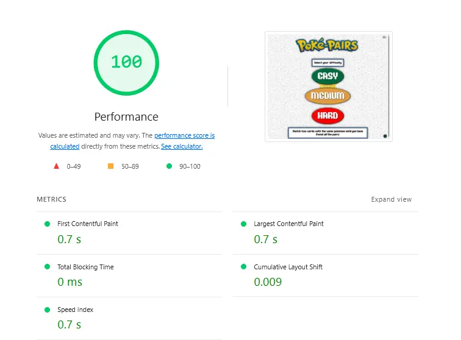

**test - Start Game Call-to-action**

- **Scenario:** The player clicks on the difficulty select buttons to start the game
- **Expected:** The game begins immediately
- **Testing:** Pressed the start game buttons
- **Result:** Game starts as expected
- **Test Status:** PASS

### User Story 3 - Difficulty Seleciton

**test 3.1 - Difficulty Selection Changes Layout**

- **Scenario:** Selecting different difficulties populates the board with different amount of cards
- **Expected:** The game board changes the amount of different cards depending on the difficulty
- **Testing:** started the game on each different difficulty
- **Result:** Grid size adjusted correctly for different difficulties
- **Test Status:** PASS

**test 3.2 - Difficulty can be changed during gameplay**

- **Scenario:** The player changes difficulty mid-way through a game
- **Expected:** The current game resets with the new difficulty settings
- **Testing:** Changed difficulty in game
- **Result:** The game reset and loaded the new difficulty
- **Test Status:** PASS

### User story 4 - Performance Tracking

**test 4.1 - Move counter increments correctly**

- **Scenario:** The player completes a turn by selecting two cards
- **Expected:** The move counter increases by one
- **Testing:** Completed a move by selecting two cards
- **Result:** The card counter updated correctly by increasing by one
- **Test Status:** Passed

Before:  
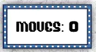  
After:  

**test 4.2 - Timer Starts and Stops correctly**

- **Scenario:** A play starts and completes the game
- **Expected:** The timer starts on game start and stops when the game is completed
- **Testing:** Observed the timer during and after the game
- **Result:** The timer starts, keeps time, and stops correctly
- **Test Status:** Passed

**test 4.3 - Error Counter Increments Correctly**

- **Scenario:** A player selects two non matching cards
- **Expected:** The error counter increases by one
- **Testing:** Made an incorrect guess in game
- **Result:** Error counter updated correctly by increasing by one
- **Test Status:** Passed

Before:  
  
After:  

### User Story 7 - Cross-device Compatibility

**test 7.1 - Responsive Layout Across Different Devices**

- **Scenario:** A player accesses the game on mobile, tablet and desktop
- **Expected:** The layout adapts correctly to different screen sizes and remains functional
- **Testing:** used Chrome Dev Tools device emulator and multiple physical devices
- **Result:** Layout displayed correctly on all tested screen sizes
- **Test Status:** Passed

Home Screen small:  
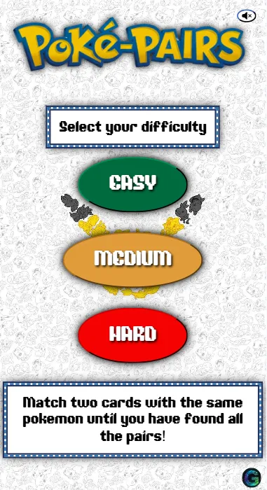  
Home Screen Large:  
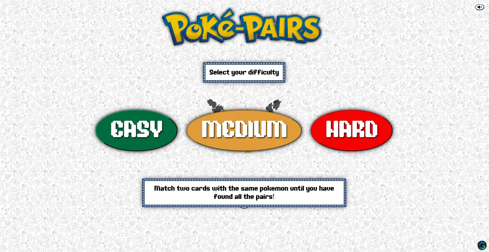

Game Screen Small:  
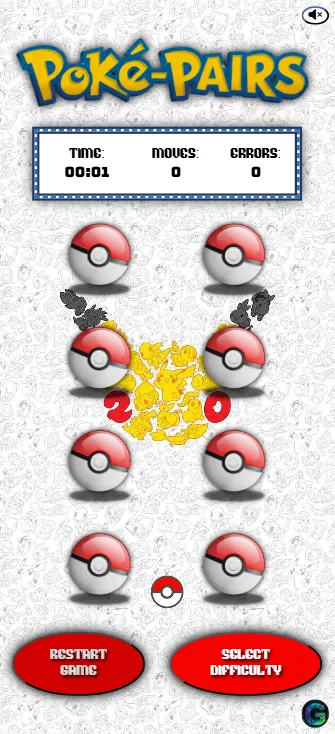  
Game Screen Large:  
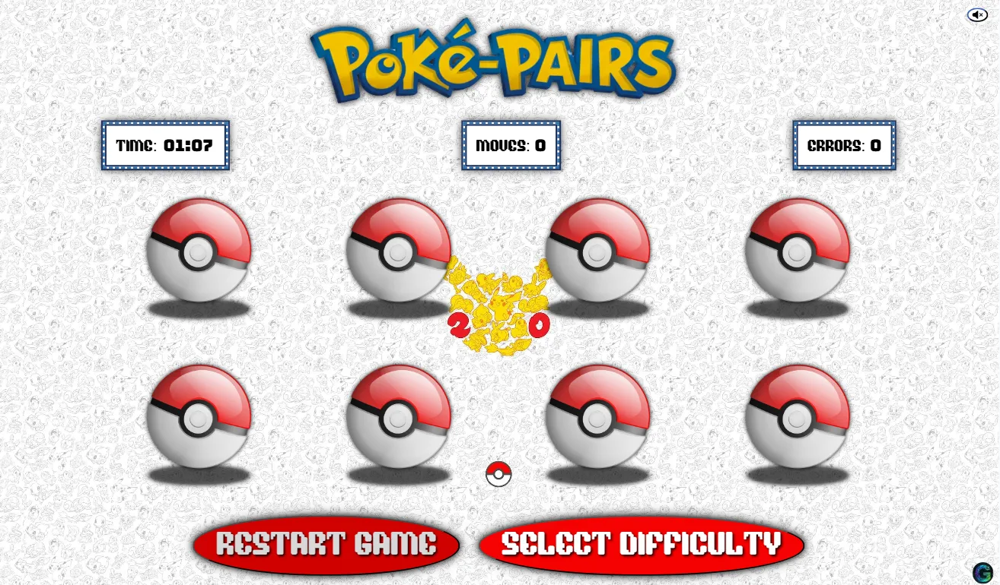

Victory Modal Small:  
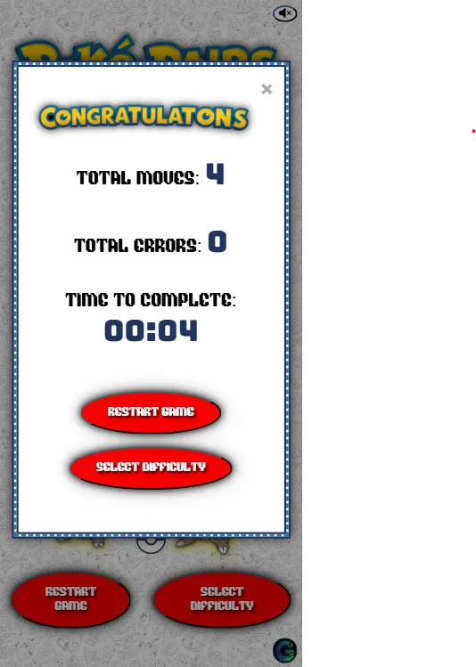
Victory Modal Large:  
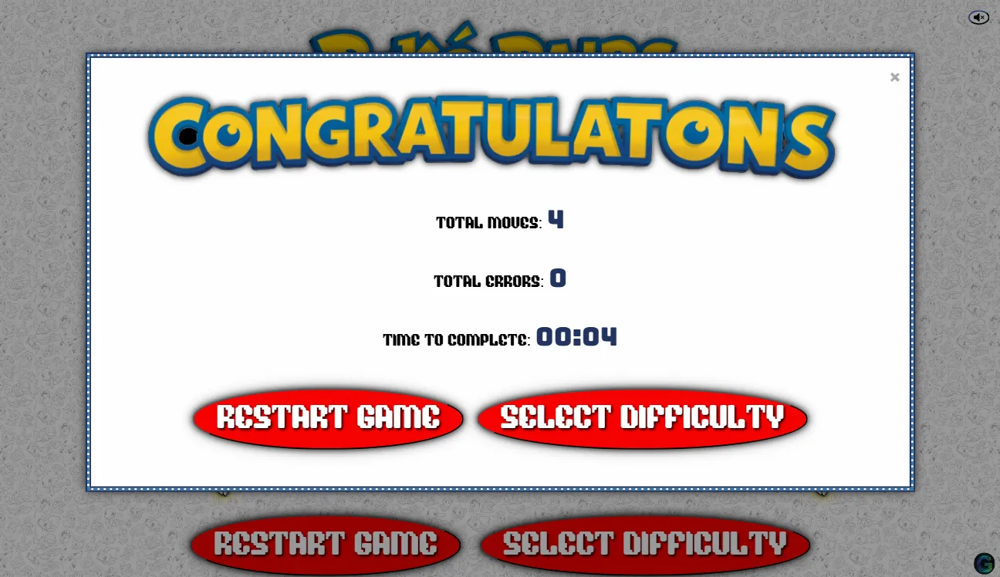

**test 7.2 - Browser Compatibility**

- **Scenario:** A player accesses the game on different modern web browsers
- **Expected:** The game functions correctly across different browsers
- **Tesitng:** Opened the game on Chrome, Firefox, Edge and Safari
- **Result:** No functional issues arose
- **Test Status:** Passed

### User Story 8 - Completion Feedback

**test 8.1 - Victory modal displays content correctly**

- **Scenario:** A player completes the game by matching all the pairs
- **Expected:** A victory modal appears with a congratulations message and game statistics
- **Testing:** Completed a game
- **Result:** Modal displays correctly with the correct stats within it
- **Test Status:** Passed

**test 8.2 - Post game Actions Function Correctly**

- **Scenario:** The player interacts with the Restart Game and Select Difficulty buttons in the modal
- **Expected:** The game restarts and loads the selected difficulty
- **Testing:** Interact with the buttons in the modal
- **Result:** Buttons functioned correctly
- **Test Status:** Passed

## Business Goal Testing

### Business Goals 1 - Create an interesting, engaging and interactive front-end game experience.

**Goal:** Deliver a fun, playable memory game that encourages users to complete and replay rounds.  
**Scenario:** A user plays the game from start to finish and is encouraged to replay using visual feedback, difficulty options, and completion messaging.  
**expected:**

- Core gameplay functions smoothly
- Visual and audio feedback reward correct actions
- layers are encouraged to replay the game

**Testing:** Played multiple full rounds across different difficulties and observed player flow and engagement  
**Result:** Gameplay was smooth, visual and audio feedbakc was clear and replay options were easily accessible  
**Test Status:** PASS

### Business Goals 2 - Demonstrate front-end development skills

**Goal:** Showcase effective use of HTML, CSS and JavaScript to build interactive game logic, UI updates, and responsive layouts.  
**Scenario:** A hypothetical assessor is reviewing and marking the site's structure, styling, and interactive features.
**Expected:**

- Clean semantic HTML structure
- Responsive layouts using CSS
- Game logic handled efficiently using JavaScript

**Testing:** Reviewed codebase and validated HTML and CSS using online validators.
**Result:** Code demonstrates effective use of technologies.
**Test Status:** PASS

### Business Goals 3 - Appeal to Pokémon fans through nostalgic theming

**Goal:** Use Generation One Pokémon, recognisable visuals, and Pokémon-inspired colours and styling to create a nostalgic experience.  
**Scenario:** A Pokémon fan visits the site and recognises Generation One Pokémon and familiar visual styles.
**Expected:**

- Use of Generation One Pokémon
- Pokémon-inspired colours, fonts, and imagery
- Consistent theme throughout the site

**Testing:** Reviewed game visuals and Pokémon selection during gameplay.  
**Result:** Theme remained consistent and recognisable throughout the game.
**Test Status:** PASS

### Business Goals 4 - Create a visually appealing and intuitive used interface

**Goal:** Ensure the game is easy to understand, visually consistent, and intuitive to navigate for first-time users.  
**Scenario:** A first-time user visits the site and attempts to start and play the game using only the on-screen interface.  
**expected:**

- Clear instructions explaining how to play
- Clearly visible and intuitive controls/buttons
- Consistent visual design across all pages and models

**Testing:** Navigated through the home page and gameplay using only the provided interface elements.
**Result:** The user was able to understand the game and navigate the interface without confusion, visual design remained consistent throughout.  
**Test Status:** PASS

### Business Goals 5 - Ensure responsive design and cross-device compatibility

**Goal:** Make the game usable and functional across mobile, tablet, and desktop devices, as well as across a range of modern browsers.  
**Scenario:** A user accesses the game on different devices and browsers.  
**Expected:**

- Responsive layout
- No functional loss across screen sizes
- Consistent behavior across browsers

**Testing:** Tested responsiveness on Google Chrome DevTools and different physical devices.  
**Result:** Game remained fully functional across tested devices and browsers.
**Test Status:** PASS

### Business Goals 6 - Deliver good performance and fast load times

**Goal:** Optimise Assets and code to ensure quick loading and smooth gameplay.  
**scenario:** A user opens the site and starts a game without delay.  
**expected:**

- Fast page load times
- Optimised assets
- Smooth gameplay performance

**Testing:** Ran lighthouse performance tests and manually observed loading behaviour.
**Result:** Performance scores were in an acceptable range and gameplay was smooth.
**Test Status:** PASS

## Code Validation Testing

HTML code validation testing was performed using the [W3C Markup Validation Service](https://validator.w3.org/). It picked up one semantic error where I had gone from `h1` to `h3` without using a `h2` element.

This was corrected and the HTML now passes code validation.

CSS code validation testing was performed using the [W3C CSS Validation Service](https://jigsaw.w3.org/css-validator/). It did not pick up any errors and the CSS passes code validation.

## Lighthouse Testing

### Final Score

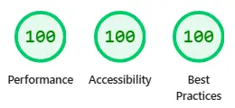

**Performance:** 100  
**Accessibility:** 100  
**Best Practices** 100

### Testing

Lighthouse testing was performed on Google Chrome DevTools and for each category has been given a score in the acceptable range.

Performance Overview 98/100:

Accessibility Overview 98/100:

Best Practises Overview 100/100:

By adding a 'landmark' to my HTML for screen readers and testing directly from the live site, I have increased my Lighthouse score to the maximum.

## Colour Testing

I have tested the colours chosen for my website to make sure that they are in line with the Web Content Accessibility Guidelines (WCAG). These tests highlighted two issues.

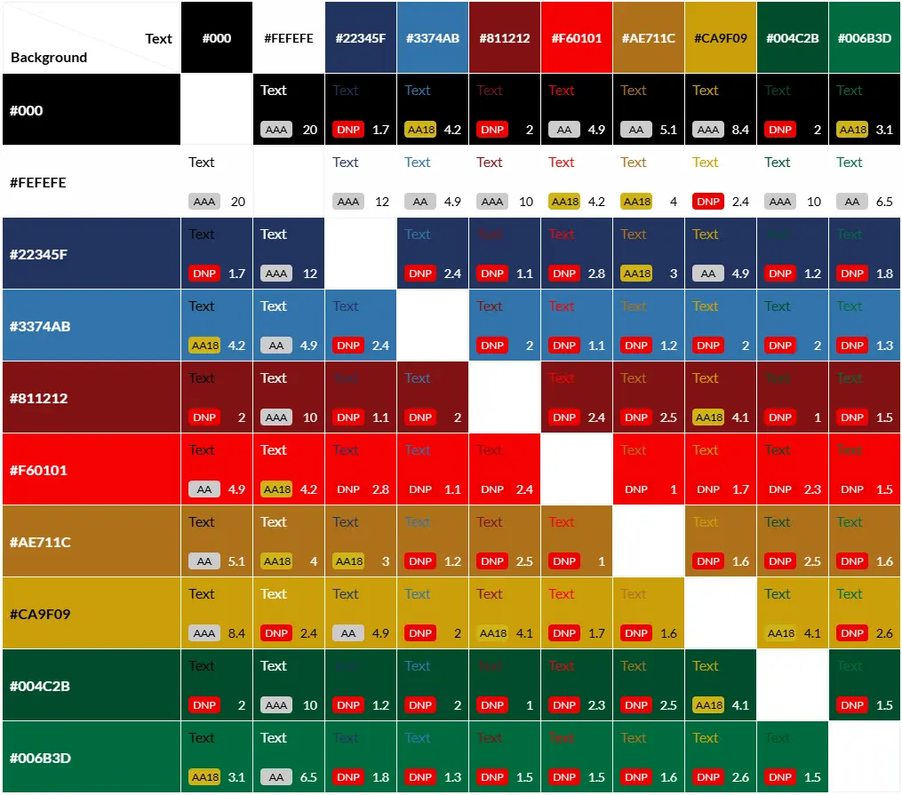

Firstly, while checking colour contrast the medium button failed this test.  
The fix was to darken the colour until its contrast score was acceptable.

Fail: 

Pass: 

Secondly, it highlighted that the font on the hard and medium buttons is only suitable for large text. To ensure this is always the case I have used a `clamp()` property on font size to ensure the font is always at least 24px.

Having addressed these two issues the site in now fully WCAG compliant.

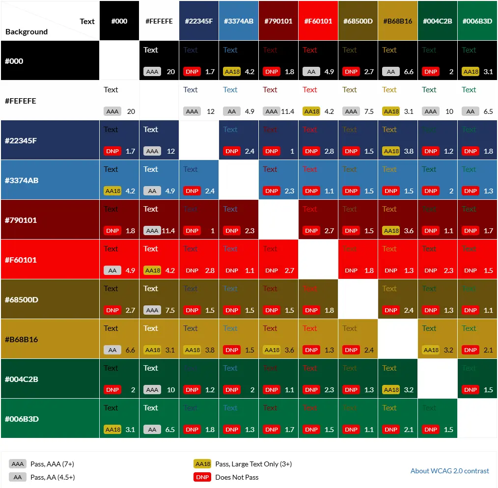

**Colour Test Status:** PASS

## Function Testing

Manual functional testing was carried out to ensure that Poke-Pairs behaves as expected from a user’s perspective. The purpose of this testing was to verify that all core gameplay features function correctly when interacted with through the user interface. The tests flow through the path of the user playing the game.

**1. Start Game**  
**Expected:** When the easy, medium and hard buttons are clicked the game board loads with 8, 16 and 32 cards respectively. The error counter, move counter and timer should read 0. The cards should be face up for one second before they 'turn' and the timer starts.  
**Testing:** Clicked on all three buttons and waited to see result  
**Result:** The game loaded the correct amount of cards and the statistics reset correctly. The cards turned over after one second and the timer started correctly.  
**Fix:** N/A  
**Status:** PASS

**2. Card flip on single click**  
**Expected:** Clicking on a face-down card should reveal the image of a Pokémon.  
**Testing:** Clicked on a single card while all cards were face down.  
**Result:** The card flipped over; moves and errors remained unchanged.  
**Fix:** N/A  
**Status:** PASS

**3. Two Nonmatching Cards**  
**Expected:** When two non-matching cards are selected they should remain visible for one second then flip back over. The move counter and the error counter should increase by one.  
**Testing:** Clicked on two cards with different Pokémon images.  
**Result:** They flipped back after a short delay and the move counter and error counter increased by one.  
**Fix:** N/A  
**Status:** PASS

**4. Two matching cards**  
**Expected:** Upon selecting a second correct card a short animation should play and the cards should remain face up. Only the move counter should increase.  
**Testing:** Selected two cards with the same Pokémon image.  
**Result:** An animation played and the move counter went up by one. The cards remained face up.  
**Fix:** N/A  
**Status:** PASS

**5. Clicking the same card twice**  
**Expected:** After clicking the card once and it turning face up, nothing should happen when I click it twice.
**Testing:** Clicked the face of the card I had just revealed.
**Result:** The game cards, error counter and move counter remain unchanged.
**Fix:** N/A
**Status:** PASS

**6. Gamer Win Condition**
**Expected:** When all the pairs have matched the timer should stop and the victory modal should appear displaying moves, errors and time.
**Testing:** Matched all the pairs of cards on the board
**Result:** Victory modal appeared with the correct game stats displayed
**Fix:** N/A
**Status:** PASS

**7 - Restart Game button**
**Expected:** restarting the game the board should load a new set of cards and the timer should restart. The error counter and the move counter should read 0
**Testing:** Restarted the game from the victory modal and from in the game board page.
**Result:** The game board loaded the correct amount of cards in their correct orientation. The timer, move counter and error counter all reset.
**Fix:** N/A
**Status:** PASS

**8 - Difficulty Select Button**
**Expected:** Pressing the change difficulty button should bring the player back to the home page where they are instructed to select their difficulty. The game should load with the new correct number of cards.
**Testing:** Clicked Select difficulty having completed an easy game and chose medium difficulty
**Result:** The game took me back to the home page then loaded the new difficulty with the correct amount of cards. The timer, error counter and move counter all reset.
**Fix:** N/A
**Status:** PASS
