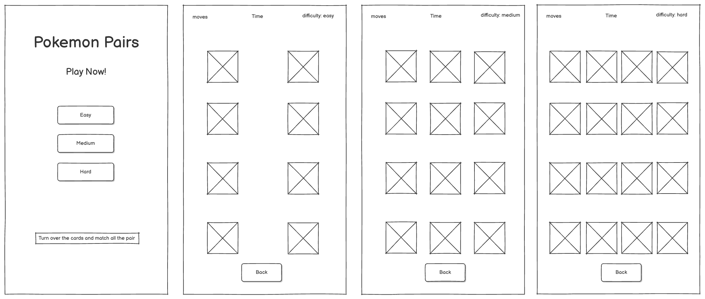
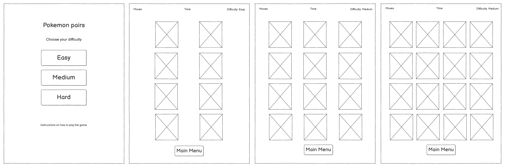
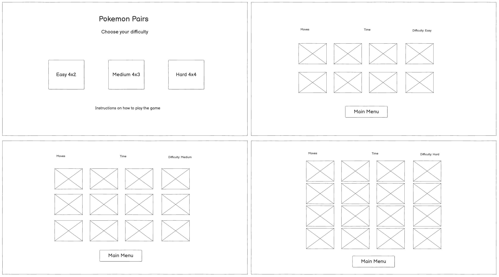
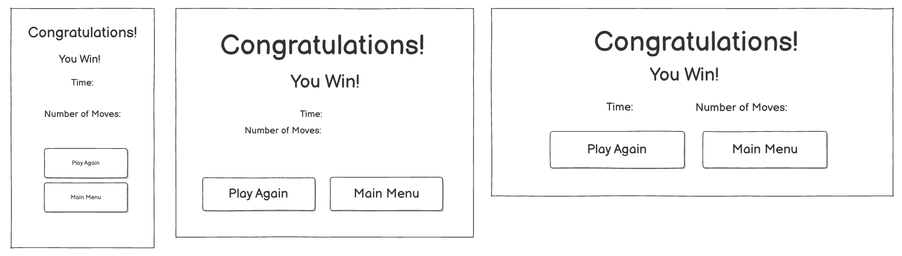

# Milestone Project Two

Title

# UX
Project goals: The goal of the project is to build an interactive front-end site. This site will take the form of a Pokemon-themed pairs game. The game should be fun, interactive, and visually appealing.

Player goals:
- To play a fun pairs game.
- To play the game on different devices.
- To play a simple, easy-to-understand, but challenging game.

Developer and business goals:
- Create an engaging game.
- Create a visually appealing game with sound.
- Create an appeal to Pokemon fans with a Pokemon theme.

User Stories

User story 1:
- As someone who enjoys playing games, I want to play a pairs memory game.
Acceptance criteria:
- Have a game board populated with cards.
- The user can flip two cards at a time; matching cards will stay flipped over while non-matching pairs will flip back after a short delay.
- When the round is finished, display a victory message.
- Readily available reset game button to play again.
Tasks:
- Create game board using HTML and CSS and populate with Pokemon cards using JavaScript.
- Create card flipping and matching logic using JavaScript.
- Create victory modal.
- Quick and simple game reset in victory modal.

User story 2:
- As a user, I want the game to start quickly to keep my interest.
Acceptance criteria:
- Ensure game loads quickly.
- Ensure game loads correctly.
- Have an appealing call to action to start the game easily and quickly.
Tasks:
- Use Lighthouse testing for page load.
- Optimise image file sizes and formats.
- Test page load on different devices.
- Create start game button on the home screen.

User story 3:
- As a user, I want to be able to increase and decrease the difficulty to add more or less challenge to the game.
Acceptance criteria:
- Have different difficulties available to the user.
- Have these difficulties readily available and easily accessible at any point during the game.
- Be able to reset the game if I have chosen a difficulty that is too hard.
Tasks:
- Create difficulty buttons on the starting page.
- Create difficulty select button on game page.
- Create difficulty select button on victory modal.

User story 4:
- As a user, I want to be able to see the time/move/error counters in order to see how well I am doing.
Acceptance criteria:
- Have a functioning move counter always visible during the game and on all difficulties.
- Have a functioning timer counting how long the player has spent on that particular round.
- Have an error counter which shows the player's error count during the game.
Tasks:
- Create move tracker.
- Have move tracker update after every turn.
- Create a timer that starts when the game starts and finishes when the game is complete.
- Create error counter.
- Have error counter update after every turn.

User story 5:
- As a user, I want feedback from the game as I make correct pairs to keep me motivated to finish.
Acceptance criteria:
- Have audio feedback for a correct pair match (Pokemon cry?).
- Have visual feedback for a correct guess (pop and jiggle animation?).
Tasks:
- Create API to gather sounds to play on a correct guess, or
- Have local sound play on correct guess.
- Have animation play on correct guess.

User story 6:
- As a user, I want a visually appealing game that inspires nostalgia with the Pokemon theme.
Acceptance criteria:
- Have original Pokemon artwork.
- Select Pokemon from the original 151 (Generation One).
- Have colours and themes which are in keeping with the Pokemon branding.
Tasks:
- Create an API to get Pokemon data.
- Select Pokemon numbers 1-151.
- Ensure colours, images and font styles used are taken from Pokemon branding.

User story 7:
- As a user, I want to be able to play the game on different devices so that I can play it anywhere.
Acceptance criteria:
- Ensure the game is responsive.
- Ensure the game works on different browsers.
- Ensure the game works on different devices.
- Ensure the game works on different operating systems.
Tasks:
- Make the game responsive using media queries across a range of different screen sizes.
- Test responsiveness with Chrome DevTools.
- Test game on different devices.
- Test game on different operating systems.
- Test game on different browsers.

User story 8:
- As a user, I want to be congratulated when I complete the game and presented with a summary of the round.
Acceptance criteria:
- Have a victory modal appear on completion with a nice message.
- Have a round summary in the victory modal.
- Easily restart the game from the modal.
- Easily change the difficulty from the modal.
Tests:
- Create victory modal.
- Make it contain a victory message.
- Make it contain a summary of the stat trackers.
- Make restart game and difficulty select buttons.

Features
- Game title
- Flippable cards
- Move counter
- Error counter
- Timer
- Different difficulties
- Victory modal
- Reset game button
- Footer with author

Design choices
- Pictures for the front and the back of the cards will be Pokemon-themed.
- Colours to be picked from Pokemon logos, artworks and other Pokemon-themed items or ideas.
- Font: primary: the 'Pokemon' title font. Secondary: something clear and game themed, 'gamepause' sans-serif.
- Simplistic, minimalist design for the board and scoreboard to keep things easy to understand.

Wireframes
Mobile:

Tablet:

Desktop:

Victory Modal:

Strategy
Scope
Structure
Skeleton
Surface

# Features
## existing features:

'Home Page':
Title
Instructions
Difficulty Select from home screen

'Game Page':
Game Timer
Move Counter
Error Counter
Pokemon cards
Reset Game Button
Difficulty Select In-Game
Victory Mopdal
Stat Summary in Victory Modal
Correct Guess Animation

features to implement:
Sounds

# Technologies used
## Languages
HTML
CSS 
JavaScript

## Libraries
Google Fonts
Game Fonts
Favicon

mobile first developement
adobe express background remover

# Testing
Test user stories
Test business goals
Code validators
Lighthouse
Colour testing
Function tests structured:
    Expected: site is expected to do x when user does y
    Testing: tested the site by doing y
    Result: the site did not do as expected because of a, b, c OR site behaved as expected
    Fix: I did z to fix this issue

Bugs:
Cards keep overflowing out of the game board. It was due to the CSS Grid automatically applying min-height: auto; to the grid. I fixed this by setting min-height to 0 on the card wrapper to allow it to shrink.

The game start buttons stopped working. I had placed an event listener that used a variable in a function before i had declared the variable globaly. This was a timing issue as javascript runs top to bottom.

Modal wasnt appearing after reseting game using modal I was of mixing 'modal.classList.add("hidden");' and 'modal.display = "none";' fixed by sticking to adding and removing the hidden class to acheive vanishing and appearing.

Error counter is creating a list of ones rather than adding a up a total. Solution: i wasnt declring the variable errors ona global scal just in the start game function so it couldnt be accessed by the update function

As I am using random numbers to select the Pokemon it is possible for the same Pokemon to be picked more than once, e.g., Bulbasaur is picked 4 times and is every Pokemon in an eight-card grid.

# Deployment
Early deployment once I have acheived MVP.
How to run this project locally within a coding environment.
Document steps on how to clone, install and run code. 